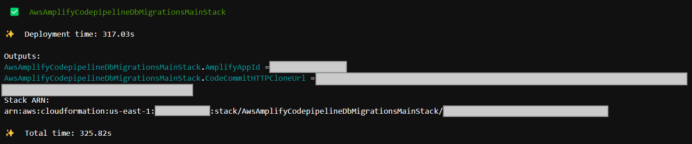
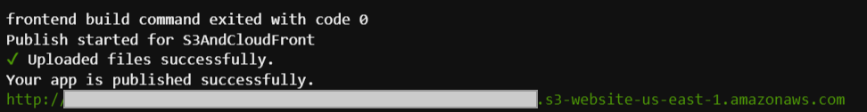

# AWS Amplify CodePipeline Deployments with Database Migrations
## Description
The core purpose of this project is to demonstrate a pattern that can be used to create a deployment pipeline for Amplify applications that require access to VPC resources. In this example the specific need that's solved is automatically deploying database migrations to a database residing in a VPC alongside an Amplify front-end and back-end deployment (`amplify publish`).

This project will use the CDK to provision all the core infrastructure required for this reference solution. The readme below provides instructions on how to initialize an Amplify front-end and back-end environment within the provisioned Amplify Application in such a way that they can be deployed via the Amplify CLI. It also provides instructions on how to setup [Alembic](https://alembic.sqlalchemy.org/en/latest/tutorial.html) which will be used to execute python-based database migrations using a secret stored in AWS Secrets Manager. This secret is also automatically created during CDK Aurora Serverless PostgreSQL cluster provisioning.

### Architecture


## Prerequisites
This example was developed and intended for Amazon Linux2 environments. Mileage may vary with other flavors of Linux or Windows.

Other requirements include the following:
- AWS CLI v1.19.112 or Later
- CDK v2.17 or Later
- NodeJS v12.x or Later
- NPM v5.x or Later
- git v2.14.1 or Later
- Amplify CLI @aws-amplify/cli v7.6.19 or Later
- Python 3.8 (3.9 had issues)
  
Ensure your environment has programatic access setup (e.g. configure a local environment, run on an EC2 instance, or leverage AWS Cloud9). This project was built using [AWS Cloud9](https://aws.amazon.com/cloud9/).

## Deployment Instructions
### Clone this Git Repository
Clone this repository using git. e.g.:
```bash
git clone https://github.com/mkrauklis/aws-amplify-codepipeline-db-migrations.git
```

### Optional: Update VPC CIDR
The VPC CIDR is defined in cdk.json and defaults to 10.1.100.0/24. This can be updated if necessary, but must have at least 256 addresses to fit the 4 64-address subnets.


### Install Node Modules
Install Node Module dependencies:
```bash
npm install
```

### Deploy
Execute cdk deploy to deploy the CDK application in your environment:
```bash
cdk deploy
```
This will create three outputs:
- AmplifyAppId
- CodeCommitHTTPCloneUrl
- CodeCommitRepositoryName



**NB**: The CDK deployment does *not* create the above outputs as environment variables. However, below they are referred to as such. Wherever you see such an environment variable (e.g. `$CodeCommitHTTPCloneUrl`) simply replace it with the value of the `cdk deploy` output.

Deploying the CDK stack will create the following:
- VPC & Subnets
- Aurora Serverless PostgreSQL Cluster & Secret
- Code Commit Repository
- Empty Amplify Application
- Code Pipeline
    - CodeBuild Project for Amplify
    - CodeBuild Project for Database Deployment
- Supporting Security Groups, Roles, SSM Parameters, etc.

You can see in the console this creates a CodePipeline with all the required steps and kicks off an execution of the pipeline. This initial execution will fail because we have not yet checked in any code and do not yet have a master branch.


### Update Secrets Manager Access Keys
The `cdk deploy` will create two secrets to store the Access Key ID/Secret. These must be updated with actual values from an Access Key tied to a user that has all the required Amplify permissions. This can be done through the AWS console:


### Clone CodeCommitHTTPCloneUrl
Clone the newly created repository. A warning will be presented that an empty repository has been cloned. This can be ignored as it is expected.

```bash
git clone $CodeCommitHTTPCloneUrl
```

### Initialize React Application
Use npx to initialize a React application in the directory that was just cloned.

```bash
npx create-react-app $CodeCommitRepositoryName
```

### CD Into Application Directory
Change directories into the directory that was just cloned/initialized.

```bash
cd $CodeCommitRepositoryName
```

### Initialize Amplify App
Initialize the amplify environment using the $AmplifyAppId output of `cdk deploy`. Use the defaults up to authentication method. For the authentication method use `AWS access keys` and specify the same values that were updated in Secrets Manager.

```bash
amplify init --appId $AmplifyAppId
```


This will initialize a backend environment named `dev` that can be seen in the console:


### Push Amplify Backend
Verify the environment by pushing the back-end. You should see that no changes are detected.

```bash
amplify push
```


### Optional: Install Amplify React UI Module
Install the Amplify React UI Module. While not explicitly required for this demo, now would be a good time to do so.

```bash
npm install --save aws-amplify @aws-amplify/ui-react
```

### Add Amplify Hosting
Add non-amplify hosting to the Amplify project. This will create the template for the hosting stack (specific resources depend on DEV/PROD configuration).

It is important to choose `Amazon CloudFront and S3` as the hosting module to execute. For this demo both DEV and PROD configurations will work. Choose defaults for the rest of the options.

```bash
amplify add hosting
```


### Publish Amplify
`amplify publish` will deploy the backend and build/deploy the frontend based on the hosting configuration.

```bash
amplify publish
```
Once published the React application will be available at the URL specified in the output of the `amplify publish` command:



### Edit React Application
Edit the `src/App.js` file in such a way that we'll be able to see changes once deployed. e.g.:


### Push to CodeCommit
Commit the changes and push to CodeCommit. This will trigger the CodePipeline to execute automatically.

```bash
git add .
git commit -m "Amplify project initialized."
git push
```

The CodePipeline will partially succeed. The CodeBuild project that deploys the amplify application will succeed and the CodeBuild project that runs the database migrations will fail since the alembic migrations have not been setup within the application:


Since the Amplify deployment was successful the changes that were made to `src/App.js` are reflected in the published website:


### Install Alembic
Install Alembic and initialize an Alembic project:

```bash
yum install -y python3-devel postgresql-devel
python3 -m venv env
source env/bin/activate
pip install psycopg2-binary
pip install postgres
pip install SQLAlchemy
pip install alembic
pip install boto3
pip install pytest

alembic init --template generic alembic
```

This will create an `alembic` directory in the root of the project.


Next, create the first migration script using the `alembic version` command:

```bash
git commit -m "Added alembic baseline."
```

This will create a migration file under the `alembic/versions` directory.

### Push to CodeCommit
Commit the changes and push to CodeCommit. This will trigger the CodePipeline to execute automatically.

```bash
git add .
git commit -m "Added alembic baseline." 
git push
```

The CodePipeline will now fully succeed:


In looking at the logs for the DatabaseDeploy step we can see the database migrations were successfully executed:


## Cleanup
Cleanup the reference example by calling the CDK destroy command:

```bash
cdk destroy
```

